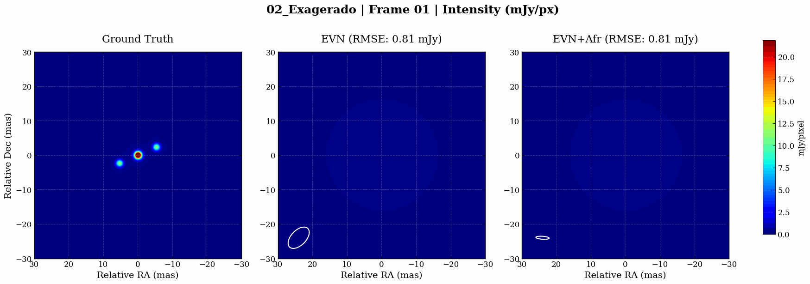

# Simulación VLBI del Jet de SS 433: Evaluación de la Red Africana

Este repositorio recoge el trabajo desarrollado para mi Trabajo de Fin de Máster (TFM). El proyecto tiene como objetivo simular la cinemática relativista del microquásar SS 433 y evaluar cuantitativamente cómo la fidelidad de las imágenes interferométricas mejora al expandir la actual European VLBI Network (EVN) con la futura red de estaciones en el continente africano. 

Para realizar estas simulaciones he utilizado la librería eht-imaging (ehtim), implementando un flujo de trabajo que abarca desde la construcción del modelo teórico hasta los algoritmos de síntesis de apertura y la extracción de gráficas para la memoria.

## Estructura del Repositorio

El código fuente se encuentra en el directorio raíz, mientras que los resultados generados se agrupan en carpetas según el escenario físico simulado:

```text
├── 01_Realista/                             # Resultados del escenario de velocidad 1.0x
│   ├── Animation_01_Realista.gif            # Animación comparativa (Modelo vs EVN vs EVN+Afr).
│   ├── Animation_EVN_01_Realista.gif        # Animación de la reconstrucción con EVN aislada.
│   ├── Animation_EVN_Africa_01_Realista.gif # Animación de la reconstrucción con EVN + África.
│   ├── Animation_Model_01_Realista.gif      # Animación del modelo matemático (Ground Truth).
+   ├── temp_frames/                         # Colección de frames individuales que conforman los GIF.
│   └── pdf_maps_sample/                     # Mapas y haces de síntesis (beams) exportados en PDF vectorial.
├── 02_Exagerado/                            # Resultados del escenario de velocidad 5.0x (Estructura análoga).
├── 03_Extremo/                              # Resultados del escenario de velocidad 20.0x (Estructura análoga).
├── global_summary/                          # Gráficas globales comparativas (RMSE, Rango Dinámico, NXCORR).
├── kine_final_centrado.gif                  # Animación de la reconstrucción de EVN del escenario 5.0x con Kine.
├── helicoidal_jet_movie_triple_2.0.py       # Código maestro: toy model, imaging pipeline y extracción de métricas.
├── innercore2.0.py                          # Código de creación y prueba del toy model del jet a escala interna.
├── ERS.py                                   # Módulo didáctico que ilustra la Síntesis de Rotación Terrestre (Earth Rotation Synthesis).
├── plotingcoordinates_satelite3.py          # Script de renderizado geográfico 3D de las estaciones interferométricas.
├── uvcolors.py                              # Módulo de generación de gráficos de cobertura UV para la memoria.
├── evn_only.txt                             # Coordenadas y especificaciones de las antenas de la red europea.
├── evn_africa.txt                           # Coordenadas y especificaciones de la red extendida a África.
├── LICENSE                                  # Licencia de uso del código.
└── README.md                                # Portada del proyecto (Este documento).
```

## Metodología y Scripts

El desarrollo teórico parte del script `innercore2.0.py`, el cual contiene el código de creación del toy model. En este módulo construí la base física y geométrica del sistema, definiendo la inyección de componentes gaussianas continuas que siguen la trayectoria de precesión del jet y estableciendo los parámetros de decaimiento de flujo a medida que el plasma relativista se aleja del núcleo central.

Una vez validado el modelo teórico, la investigación principal se ejecuta mediante `helicoidal_jet_movie_triple_2.0.py`. Este es el código que integra el toy model con el pipeline de imagen (imaging pipeline) y realiza todos los cálculos para los gráficos de análisis. A través de este script genero una simulación temporal de 43 días bajo distintos escenarios de velocidad, simulo las observaciones interferométricas inyectando ruido térmico y aplico procesos iterativos de auto-calibración por fases. Además, este código centraliza la extracción de todas las métricas cuantitativas (como el RMSE, la correlación cruzada normalizada y el rango dinámico) y genera las curvas de evolución global que demuestran la mejora de la red combinada.

Para ilustrar topológicamente la distribución espacial de la red, desarrollé el script `plotingcoordinates_satelite3.py`. Este módulo convierte las coordenadas cartesianas geocéntricas (ECEF) de los telescopios a coordenadas esféricas empleando la librería pyproj. Posteriormente, proyecta las estaciones europeas y africanas sobre un modelo esférico tridimensional de la Tierra mediante cartopy. Esta visualización resulta fundamental en la memoria para contextualizar la enorme extensión física de las líneas de base intercontinentales añadidas.

Para explicar el fundamento físico de la interferometría en la memoria, implementé el módulo `ERS.py`. Este código utiliza un subconjunto reducido de cinco antenas para demostrar el concepto de Síntesis de Rotación Terrestre (Earth Rotation Synthesis). El script genera un panel secuencial que vincula visualmente la rotación del modelo tridimensional de la Tierra con la acumulación simultánea de trazas en el plano de frecuencias espaciales, evidenciando cómo el movimiento planetario permite a una red dispersa de antenas sintetizar una apertura equivalente al diámetro terrestre.

Para respaldar el análisis instrumental en la memoria del TFM, desarrollé el script `uvcolors.py`, destinado exclusivamente a generar los gráficos de cobertura en el plano UV. Este código calcula la ventana de observación óptima para el tránsito de SS 433 y mapea cómo se llena el plano de frecuencias espaciales con la rotación terrestre. Mediante un sistema de gradientes de color cronológicos, estas gráficas permiten visualizar claramente cómo las líneas de base Norte-Sur que aportan las estaciones africanas completan las regiones no muestreadas por la red europea aislada.

## Resultados Destacados

La siguiente animación ilustra el resultado del proceso de reconstrucción dinámico bajo el escenario de cinemática de exageración moderada (x5), comparando el modelo matemático original (generado por el toy model) con las reconstrucciones sintéticas de ambas redes interferométricas:



El análisis de las métricas extraídas durante las simulaciones confirma la necesidad de la expansión de la red. La incorporación de antenas en latitudes sur (como la estación de Hartebeesthoek o los futuros nodos en Ghana y Namibia) aporta líneas de base que son críticas para la resolución angular. 

Esto resuelve uno de los problemas inherentes de la EVN en estas declinaciones cercanas al ecuador. Por la elongación vertical del haz de síntesis (clean beam) al observar la elipse de resolución en los mapas generados por el pipeline es evidente que la red conjunta EVN+África produce un haz mucho más circular, lo que se traduce en una caída del RMSE, una estabilización de la fase de clausura y una reducción sustancial de los artefactos numéricos introducidos por el algoritmo de limpieza.

## Ejecución del Código

Para reproducir los experimentos, es necesario disponer de un entorno de Python 3.8 o superior y las dependencias de análisis estándar:

```bash
pip install numpy matplotlib imageio scikit-image cartopy pyproj
```

Además, es imprescindible instalar el framework de simulación interferométrica:

```bash
pip install eht-imaging
```
Para generar la visualización esférica de la red de telescopios sobre la superficie terrestre:

```bash
python plotingcoordinates_satelite3.py
```
Para generar el panel secuencial de Síntesis de Rotación Terrestre (ERS):

```bash
python ERS.py
```

Para generar los mapas vectoriales del plano UV utilizados en la memoria:

```bash
python uvcolors.py
```

Para ejecutar el código maestro completo (modelado, procesado de imagen y extracción de gráficas), el cual genera automáticamente la estructura de directorios y resultados:

```bash
python helicoidal_jet_movie_triple_2.0.py
```
*Nota: Este último proceso requiere un tiempo de cómputo elevado debido a los múltiples bucles de optimización del Imager y los pasos sucesivos de self-calibration para cada día de observación. En mi caso con una máquina virtual con buenas prestaciones ha llegado a tardar un par de días).*

---
Trabajo de Fin de Máster de Candela Chico Herrera
Año 2026
